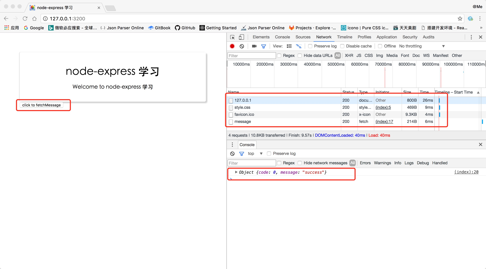

# Router 路由配置



**路由是指如何定义应用的端点（URIs）以及如何响应客户端的请求。**    

路由是由一个 URI、HTTP 请求（GET、POST等）和若干个句柄组成，它的结构如下： app.METHOD(path, [callback...], callback)， app 是 express 对象的一个实例， METHOD 是一个 HTTP 请求方法， path 是服务器上的路径， callback 是当路由匹配时要执行的函数。

## app.METHOD 路由方法

```
// GET method route
app.get('/', function (req, res) {
  res.send('GET request to the homepage');
});

// POST method route
app.post('/', function (req, res) {
  res.send('POST request to the homepage');
});
```

## app.route(path)

Returns an instance of a single route, which you can then use to handle HTTP verbs with optional middleware. Use app.route() to avoid duplicate route names (and thus typo errors).   
返回一个路由对象，该对象通过不同的中间件函数处理不同的http请求，`app.route(path)`由于是链式定义，因此可以避免重复定义`路由路径`   

```js
var app = express();

app.route('/events')                            // 这里定义了请求路径`/events`
.all(function(req, res, next) {                 // .all() 所有匹配请求都会进入此中间件
  // runs for all HTTP verbs first
  // think of it as route specific middleware!
})
.get(function(req, res, next) {                 // 匹配get请求
  res.json(...);
})
.post(function(req, res, next) {                // 匹配post请求
  // maybe add a new event...
})
```

## 路由路径

_可以为请求处理提供多个回调函数，其行为类似 中间件。唯一的区别是这些回调函数有可能调用 next('route')方法而略过其他路由回调函数。可以利用该机制为路由定义前提条件，如果在现有路径上继续执行没有意义，则可将控制权交给剩下的路径_

## app.use([path,] function [, function...])
Mounts the middleware function(s) at the path. If path is not specified, it defaults to “/”. 挂在中间件函数到指定路径   

`A route will match any path, which follows its path immediately with a “/”. For example: app.use('/apple', ...) will match “/apple”, “/apple/images”, “/apple/images/news”, and so on.'/apple' 会匹配以'/apple'开始的所有路径`

## express.Router
可使用 express.Router 类创建模块化、可挂载的路由句柄

**birds.js**

```js
var express = require('express');
var router = express.Router();                  // 使用express.Router()创建路由对象

// 该路由使用的中间件
router.use(function timeLog(req, res, next) {   // 匹配所有
  console.log('Time: ', Date.now());
  next();
});
// 定义网站主页的路由
router.get('/', function(req, res) {            //  匹配'/'返回首页字符串
  res.send('Birds home page');
});
// 定义 about 页面的路由
router.get('/about', function(req, res) {       // 匹配'/about'返回about页字符串
  res.send('About birds');
});

module.exports = router;                        // 抛出路由对象
```

**app.js**

```js
var birds = require('./birds');
...
app.use('/birds', birds);                       // 使用app.use(path,function)匹配请求路由，如'/birds' & '/birds/about'
```

## 总结

*纯属个人理解，不当之处请斧正*

`app.METHOD` 和 `app.route(path)` 都是用于定义`API`请求的，所有有`post` `put` `put` ...     

`app.use + express.Router` 用于定义`页面请求的路由` ，只有`get`方式

## 参考文档

[路由](http://www.expressjs.com.cn/guide/routing.html)    
[Router](http://www.expressjs.com.cn/4x/api.html#router)    
[router in express 4](http://lostjs.com/2014/04/24/router-in-express-4)   
